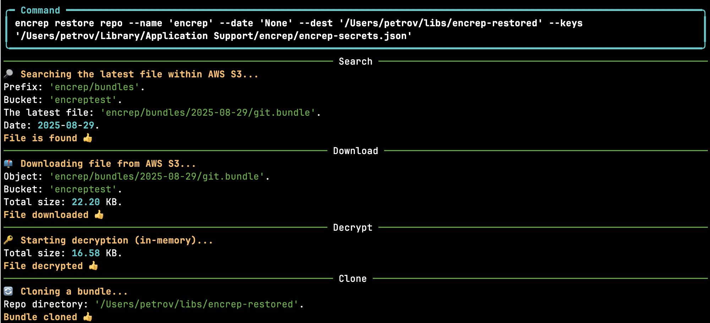
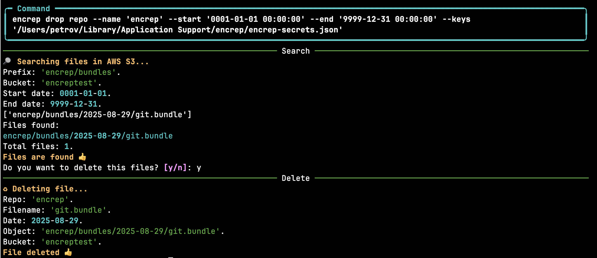

# Encrep v. 1.0.0

**CLI tool for dumping and restoring Git repos via AWS S3.**

Encryption, easy management, and pretty printing.

The MIT License (MIT). Copyright © 2025 Anatoly Petrov <petrov.projects@gmail.com>

# Rationale

Backups are crucial for sustainable development.
Even with cloud-based solutions, a Git repository can be compromised or accidentally deleted - either by a malicious actor or by the owner.

Also, in the age of LLMs, there's growing concern about whether codebases stored in the cloud are truly secure.
There are numerous discussions about the privacy policies of major providers, particularly in the context of training AI models on private repos.

Example: [GitHub Community Discussion](https://github.com/orgs/community/discussions/135400)

As a result, many companies choose to use self-hosted Git servers. However, for solo devs this may be overkill.

**Encrep** addresses these concerns with a straightforward solution:

- Develop using a local Git repository.
- Use **Encrep** to regularly back up your local repo to AWS S3.

With this approach, your codebase remains safe - even if your workstation fails.
Moreover, since **Encrep** dumps to S3 only **encrypted data**, you don’t need to worry about anyone accessing your codebase.

# Installation

**Encrep** requires Python 3.13. Ensure that you have the appropriate version of Python installed by running `which python` or `which python3`.

If everything is set up correctly, run `pip install encrep` or `pip3 install encrep` in your terminal.

This will download the package from [PyPi](https://pypi.org/project/encrep/) and add **Encrep** to your `PATH`.

To verify that the installation was successful, run `which encrep`.

# Overview

## General

**Encrep** allows you to create backups for both versioned files (i.e., files under source control) and unversioned files (such as those specified in `.gitignore`, `.git/info/exclude`, etc.).

Backups for unversioned files can also be useful (for tracking assets like fonts, icons, images, test samples, third-party libraries).

Most **Encrep** CLI commands let you specify the exact backup target using one of the following subcommands:

- `project`: Targets both versioned and unversioned files.
- `repo`: Targets only versioned files.
- `misc`: Targets only unversioned files.

Examples:

- `encrep dump project ...`: Uploads both versioned and unversioned files (repo + misc) to AWS S3.
- `encrep restore repo ...`: Restores only versioned files (repo) from AWS S3.
## Dumping repo/misc

For dumping *versioned files (repo)*, **Encrep** performs the following operations:

- Packages a Git repo into a single, portable binary file using the `git bundle create --all` command (full backup with all refs; already compressed).
- Verifies the bundle with the `git bundle verify` command (checks the validity and integrity of a Git bundle file).
- Encrypts the bundle (in-memory) with `cryptography.fernet.Fernet` and a private key specified in the `encrep-secrets.json` file (symmetric authenticated cryptography with AES and HMAC).
- Uploads the encrypted bundle to AWS S3 using the `boto3` low-level S3 client.

For dumping *unversioned files (misc)*, **Encrep** performs the following operations:

- Retrieves a list of unversioned files (excluded from source control) using the `git ls-files --others` command.
- Excludes files from this list that are affected by any exclusion rule specified during setup (e.g., caches, private keys, etc.).
- Archives unversioned files using Python's standard `zipfile` module (`ZIP_DEFLATED` method, highest compression level).
- Encrypts the archive (in-memory) with `cryptography.fernet.Fernet` (symmetric authenticated cryptography with AES and HMAC).
- Uploads the encrypted archive to AWS S3 using the `boto3` low-level S3 client.

## Restoring repo/misc

For restoring *versioned files (repo)*, **Encrep** performs the following operations:

- Downloads the encrypted bundle from AWS S3 using the `boto3` low-level S3 client.
- Decrypts the bundle (in-memory) with `cryptography.fernet.Fernet` and a private key specified in the `encrep-secrets.json` file.
- Clones the bundled repo to a target directory (must be empty) using the `git clone` command.

For restoring *unversioned files (misc)*, **Encrep** performs the following operations:

- Downloads the encrypted archive from AWS S3 using the `boto3` low-level S3 client.
- Decrypts the archive (in-memory) with `cryptography.fernet.Fernet` and a private key specified in the `encrep-secrets.json` file.
- Extracts all unversioned files to the target directory using Python's standard `zipfile` module (without overwriting existing files).

## Security

*Firstly*, ensure that your Encrep secrets file is secure. It stores the AWS access key ID (AKID), AWS secret key (SK), and the Encrep secret key. 
This is very sensitive data and it is not encrypted. The secrets file is automatically created by **Encrep** during the setup stage when you run the `encrep setup` command.  
You can locate your secrets file with the `encrep loc` command, and you may delete it with the `encrep cleanup` command 
(simple unlinking; for complete deletion, including multiple overwrites, use specialized tools).

*Secondly*, remember that all dump files stored in AWS S3 are encrypted by **Encrep** itself, not by AWS.  
Thus, if you lose the Encrep secret key specified in the `encrep-secrets.json` file, you will not be able to restore your repos.

*Thirdly*, **Encrep** uses `cryptography.fernet.Fernet` under the hood, which provides authenticated cryptography.  
This means that Fernet verifies the integrity of the data and ensures it has not been tampered before returning it.
Thus, you don't need to use `SHA256` or other hashes for your dump files; everything will be handled by Fernet.

*Fourthly*, we've made every effort to make **Encrep** as secure as possible. We've used only well-known third-party packages 
(`boto3`, `cryptography`, `typer`, `rich` for the core module; `pytest`, `moto` for testing and mocking) and thoroughly tested our code.  
At the same time, since we are dealing with your AWS keys, we recommend that you inspect the codebase yourself.  
It's well-structured and well-documented, so it's easy to understand and navigate.

# Usage

Here is a how-to example featuring some of the most useful **Encrep** commands.

The current working directory (CWD) is always the `.../encrep` folder, since we are going to dump and restore **Encrep** itself.

**Encrep** provides useful defaults, so you'll rarely need to specify explicit CLI arguments.  
Just set the proper working directory (in your case, it will be the root directory of your repo).

All arguments (including defaults) will be printed in your terminal (see the *Command* panel).

## Step 1. Set up secrets, AWS region, and bucket name.

`>> encrep setup`

## Step 2. Dump a repo to AWS S3.

`>> encrep dump repo`

## Step 3. Display the structure of the AWS S3 bucket specified in the secrets file (optional).

`>> encrep tree`

## Step 4. List projects available from AWS S3 (optional).  

`>> encrep ls project`

## Step 5. List bundles available from AWS S3 (optional).

`>> encrep ls repo`

## Step 6. Restore a repo from AWS S3.

`>> encrep restore repo`

## Step 7. Delete multiple repo backups from AWS S3 within a specified date range (optional).

`>> encrep drop repo`

# Commands

Below are **Encrep** commands with brief descriptions:

| Command | Description                                                               |
|---------|---------------------------------------------------------------------------|
| setup   | Set up secrets, AWS region, and bucket name.                              |
| cleanup | Remove the secrets file.                                                  |
| loc     | Show path to secrets file.                                                |
| tree    | Display the structure of the AWS S3 bucket specified in the secrets file. |
| ls      | List the repos available from AWS S3.                                     |
| dump    | Dump a repo to AWS S3.                                                    |
| restore | Restore a repo from AWS S3.                                               |
| rm      | Remove a single repo backup from AWS S3 for the specified date.           |
| drop    | Delete multiple repo backups from AWS S3 within a specified date range.   |

For more details, use the built-in **Encrep** help.
For example, run `encrep dump repo --help` to get a description of the `dump repo` subcommand and see the available options.

You can also check the auto-generated docs here: [COMMANDS.md](/COMMANDS.md). To generate the docs yourself, run `typer encrep.main utils docs --output README.md --name encrep`.

# Testing

**Encrep** is tested with [pytest](https://github.com/pytest-dev/pytest) framework. 
We also use [moto](https://github.com/getmoto/moto) to mock AWS S3.

# License

**Encrep** is licensed under the MIT License, see [LICENSE](LICENSE) for more information.